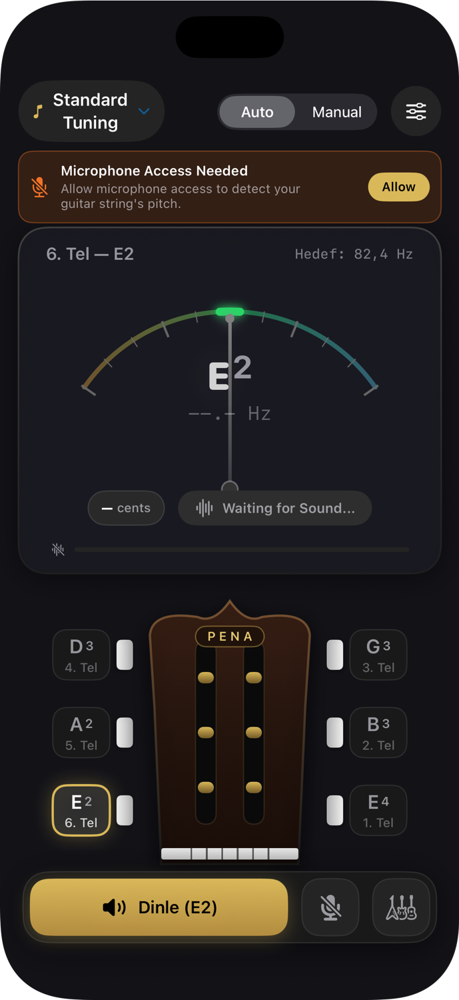
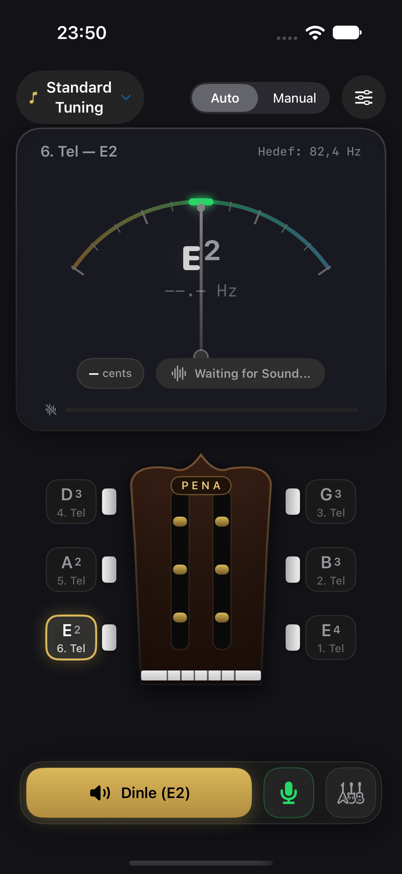
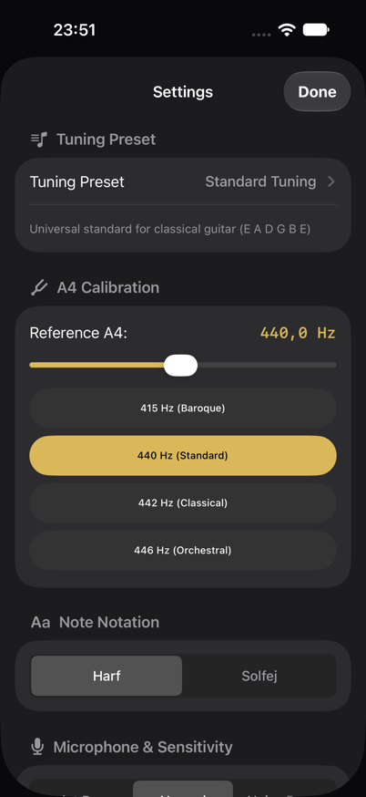

<div align="center">

# 🎸 Pena

**Gitarını akortla, çal, öğren. · Tune, play, and learn your guitar.**


### 🌐 Language / Dil

**[🇹🇷 Türkçe](#-türkçe)** · **[🇬🇧 English](#-english)**

<br>



</div>

---

## 🇹🇷 Türkçe

[Özellikler](#-özellikler) · [Ekran görüntüleri](#-ekran-görüntüleri) · [Mimari](#-mimari) · [Başlarken](#-başlarken) · [Yerelleştirme](#-yerelleştirme) · [Tasarım dili](#-tasarım-dili) · [Lisans](#-lisans)

Pena; gerçek zamanlı pitch algılama, haptik metronom, interaktif akor kütüphanesi ve tarz bazlı 30 günlük müfredatları tek bir SwiftUI uygulamasında birleştiren, gitarcılar için tasarlanmış bir iOS akort ve öğrenme asistanıdır.

### ✨ Özellikler

#### 🎵 Akort (Tuner)
| | |
|---|---|
| **Gerçek zamanlı perde algılama** | `AVAudioEngine` tabanlı düşük gecikmeli mikrofon dinleme ve özel bir pitch detection algoritması. |
| **Analog ibre + headstock görseli** | Anlık, sezgisel geri bildirim veren bir gauge gösterge ve sapı canlandıran bir headstock görselleştirmesi. |
| **6 akort düzeni** | Standart, Drop D, Yarım Ses Pes (E♭), DADGAD, Açık D, Açık G. |
| **Otomatik / Manuel mod** | İster algılanan telin otomatik takibi, ister tel seçerek manuel akort. |
| **Referans ses & hassasiyet** | Referans ses çalma, cents göstergesi, akort durumuna göre renk/haptik geri bildirim. |

#### 📚 Akademi (Academy)
| | |
|---|---|
| **10 tarz × 30 gün** | Blues, Bossa Nova, Caz, Country, Fingerstyle, Flamenko, Funk, Klasik, Rock, Türkü. |
| **Günlük plan detayı** | Her plan; günlük pratik hedefleri, gerekli malzemeler, önkoşullar ve ay sonu hedefiyle gelir. |
| **Fretboard yol haritası** | Gün bazlı ders detay ekranlarıyla adım adım ilerleme. |
| **Kalıcı ilerleme** | İlerleme `CourseProgressStore` ile cihazda saklanır. |

#### 🛠️ Araçlar (Tools)
| | |
|---|---|
| **Haptik metronom** | Dokunsal geri bildirimli, ayarlanabilir tempo. |
| **İnteraktif akor kütüphanesi** | Akorları keşfet ve çalışma pratiğine entegre et. |

### 📸 Ekran görüntüleri

<table>
  <tr>
    <td width="33%"></td>
    <td width="33%"></td>
    <td width="33%"></td>
  </tr>
  <tr>
    <td align="center"><b>Akort ekranı</b> — gauge + headstock</td>
    <td align="center"><b>Çalışırken</b> — canlı akort tespiti</td>
    <td align="center"><b>Ayarlar</b> — A4 kalibrasyonu, hassasiyet</td>
  </tr>
</table>

### 🧱 Mimari

Pena, tamamen **SwiftUI** ve Swift'in modern `async/await` eşzamanlılık modeliyle yazılmıştır (Combine kullanılmaz).

```
Pena/
├── AudioEngineManager.swift      # AVAudioEngine kurulumu, mikrofon izinleri, oturum yönetimi
├── Audio/
│   ├── PitchDetector.swift       # Perde (frekans) algılama algoritması
│   └── PitchStabilizer.swift     # Algılanan perdeyi yumuşatma / kararlılaştırma
├── GuitarModel.swift             # Tel, akort düzeni, akort durumu ve müzik teorisi yardımcıları
├── TunerViewModel.swift          # Akort ekranının durum yönetimi
├── TunerMainView.swift           # Akort sekmesi arayüzü
├── GaugeMeterView.swift          # Analog ibre göstergesi
├── HeadstockView.swift           # Gitar sapı görselleştirmesi
├── SettingsSheetView.swift       # Ayarlar (A4 kalibrasyonu, hassasiyet, vb.)
├── Courses/
│   ├── CourseModel.swift         # Kurs/ders veri modelleri (esnek JSON decode)
│   ├── ChordDatabase.swift       # Akor veritabanı
│   ├── CourseProgressStore.swift # İlerleme kalıcılığı
│   └── Resources/*.json          # 10 tarzın 30 günlük müfredat verisi
└── Views/
    ├── Academy/                  # Katalog, yol haritası, gün detayı, pratik oturumu
    └── Tools/                    # Metronom ve akor kütüphanesi arayüzleri
```

**Veri akışı.** `AudioEngineManager`, mikrofon girişini `PitchDetector`'a besler; algılanan ham frekans `PitchStabilizer` ile yumuşatılır ve `TunerViewModel`'e iletilir. View model, aktif akort düzenindeki (`TuningPreset`) en yakın tele göre cents farkını (`MusicPitchHelper`) hesaplar ve `TuningStatus` (tam akort / pes / tiz) olarak `TunerMainView`'e yansıtır.

| Katman | Teknoloji |
|---|---|
| UI | SwiftUI |
| Durum yönetimi | Observation (`@Observable`), `async/await` |
| Ses | `AVAudioEngine`, özel pitch detection |
| Kalıcılık | `UserDefaults` / dosya tabanlı (`CourseProgressStore`) |
| Veri | Statik JSON müfredatlar (`Courses/Resources`) |
| Erişilebilirlik | Dynamic Type, VoiceOver |

Uygulama üç ana sekmeden oluşur (`ContentView.swift`): **Akort**, **Akademi**, **Araçlar**.

### 🚀 Başlarken

#### Gereksinimler

| | Minimum |
|---|---|
| iOS / iPadOS | 27.0 |
| Xcode | iOS 27 SDK |
| Mikrofon erişimi | Gerçek perde algılama için fiziksel cihaz önerilir |

#### Çalıştırma
```bash
open Pena.xcodeproj
```
Xcode içinde `Pena` şemasını seçip çalıştırın (⌘R).

#### Testler
```bash
xcodebuild test -project Pena.xcodeproj -scheme Pena -destination 'platform=iOS Simulator,name=iPhone 16'
```
Test paketi `PenaTests/` altında yer alır ve perde algılama, akort kararlılaştırma, tel eşleştirme ve kurs modeli için birim testleri içerir.

### 🌍 Yerelleştirme

Arayüz metinleri `Localizable.xcstrings` üzerinden yönetilir; varsayılan dil Türkçedir. Yeni dil eklemek için Xcode'un String Catalog desteğini kullanın.

### 🎨 Tasarım Dili

Koyu tema üzerine oturan **"Pena Signature Gold"** vurgu rengiyle sade, odaklanmayı kolaylaştıran bir arayüz. Dynamic Type ve VoiceOver desteği göz önünde bulundurularak geliştirilmiştir — bkz. `audit/pena-ui/04-dynamic-type-ax3.png`.

### 📄 Lisans

Bu proje için lisans henüz belirlenmedi.

**[⬆ Dil seçimine dön](#-language--dil)**

---

## 🇬🇧 English

[Features](#features) · [Screenshots](#screenshots) · [Architecture](#architecture) · [Getting started](#getting-started) · [Localization](#localization) · [Design language](#design-language) · [License](#license)

Pena is an iOS tuning and learning companion for guitarists, combining real-time pitch detection, a haptic metronome, an interactive chord library, and style-based 30-day curricula in a single SwiftUI app.

### ✨ Features

#### 🎵 Tuner
| | |
|---|---|
| **Real-time pitch detection** | `AVAudioEngine`-based low-latency microphone input and a custom pitch detection algorithm. |
| **Analog gauge + headstock view** | A gauge meter and an animated headstock visualization for instant, intuitive feedback. |
| **6 tuning presets** | Standard, Drop D, Half Step Down (E♭), DADGAD, Open D, Open G. |
| **Auto / Manual mode** | Automatically track the detected string, or pick a string manually. |
| **Reference tone & accuracy** | Reference tone playback, cents readout, color/haptic feedback based on tuning status. |

#### 📚 Academy
| | |
|---|---|
| **10 styles × 30 days** | Blues, Bossa Nova, Jazz, Country, Fingerstyle, Flamenco, Funk, Classical, Rock, Turkish Folk. |
| **Daily plan detail** | Each plan ships with daily practice goals, required materials, prerequisites and an end-of-month target. |
| **Fretboard roadmap** | Step-by-step progress through day-by-day lesson detail screens. |
| **Persistent progress** | Progress is stored on-device via `CourseProgressStore`. |

#### 🛠️ Tools
| | |
|---|---|
| **Haptic metronome** | Adjustable tempo with tactile feedback. |
| **Interactive chord library** | Explore chords and fold them into practice sessions. |

### 📸 Screenshots

<table>
  <tr>
    <td width="33%"></td>
    <td width="33%"></td>
    <td width="33%"></td>
  </tr>
  <tr>
    <td align="center"><b>Tuner</b> — gauge + headstock</td>
    <td align="center"><b>Runtime</b> — live tuning detection</td>
    <td align="center"><b>Settings</b> — A4 calibration, tolerance</td>
  </tr>
</table>

### 🧱 Architecture

Pena is built entirely with **SwiftUI** and Swift's modern `async/await` concurrency model (no Combine).

```
Pena/
├── AudioEngineManager.swift      # AVAudioEngine setup, mic permissions, session management
├── Audio/
│   ├── PitchDetector.swift       # Pitch (frequency) detection algorithm
│   └── PitchStabilizer.swift     # Smoothing/stabilizing the detected pitch
├── GuitarModel.swift             # String, tuning preset, tuning status, and music theory helpers
├── TunerViewModel.swift          # Tuner screen state management
├── TunerMainView.swift           # Tuner tab UI
├── GaugeMeterView.swift          # Analog gauge meter
├── HeadstockView.swift           # Guitar headstock visualization
├── SettingsSheetView.swift       # Settings (A4 calibration, tolerance, etc.)
├── Courses/
│   ├── CourseModel.swift         # Course/lesson data models (flexible JSON decoding)
│   ├── ChordDatabase.swift       # Chord database
│   ├── CourseProgressStore.swift # Progress persistence
│   └── Resources/*.json          # 30-day curriculum data for each of the 10 styles
└── Views/
    ├── Academy/                  # Catalog, roadmap, day detail, practice session
    └── Tools/                    # Metronome and chord library UI
```

**Data flow.** `AudioEngineManager` feeds microphone input into `PitchDetector`; the raw detected frequency is smoothed by `PitchStabilizer` and forwarded to `TunerViewModel`. The view model computes the cents offset (`MusicPitchHelper`) against the nearest string in the active `TuningPreset`, and reflects it as a `TuningStatus` (in-tune / flat / sharp) in `TunerMainView`.

| Layer | Technology |
|---|---|
| UI | SwiftUI |
| State | Observation (`@Observable`), `async/await` |
| Audio | `AVAudioEngine`, custom pitch detection |
| Persistence | `UserDefaults` / file-based (`CourseProgressStore`) |
| Data | Static JSON curricula (`Courses/Resources`) |
| Accessibility | Dynamic Type, VoiceOver |

The app has three main tabs (`ContentView.swift`): **Tuner**, **Academy**, **Tools**.

### 🚀 Getting Started

#### Requirements

| | Minimum |
|---|---|
| iOS / iPadOS | 27.0 |
| Xcode | iOS 27 SDK |
| Microphone access | A physical device is recommended for real pitch detection |

#### Run
```bash
open Pena.xcodeproj
```
Select the `Pena` scheme in Xcode and run (⌘R).

#### Tests
```bash
xcodebuild test -project Pena.xcodeproj -scheme Pena -destination 'platform=iOS Simulator,name=iPhone 16'
```
The test suite lives under `PenaTests/` and covers pitch detection, pitch stabilization, string matching, and course models.

### 🌍 Localization

UI strings are managed via `Localizable.xcstrings`; the default language is Turkish. Use Xcode's String Catalog support to add new languages.

### 🎨 Design Language

A dark theme accented with **"Pena Signature Gold"**, designed to be clean and distraction-free. Built with Dynamic Type and VoiceOver support in mind — see `audit/pena-ui/04-dynamic-type-ax3.png`.

### 📄 License

No license has been chosen for this project yet.

**[⬆ Back to language picker](#-language--dil)**
